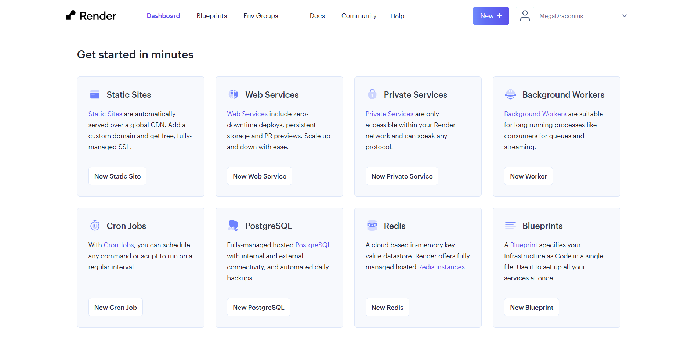
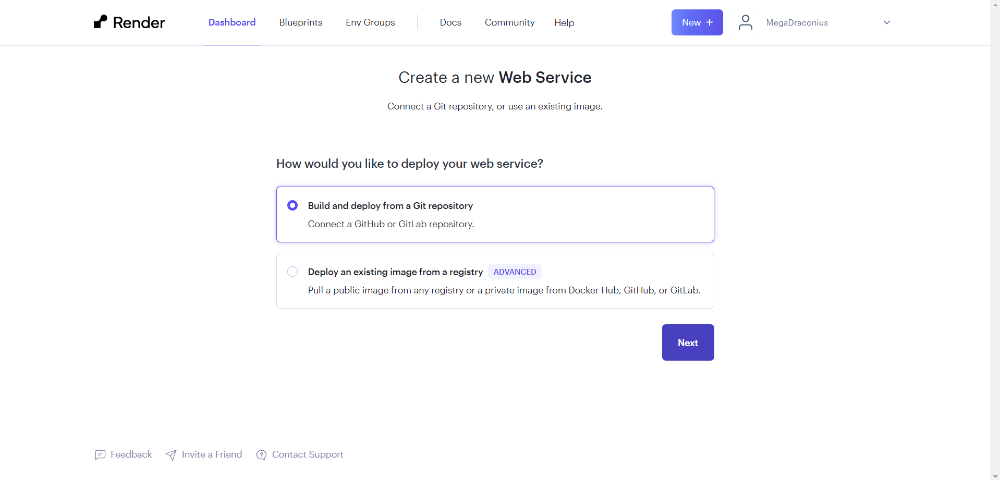
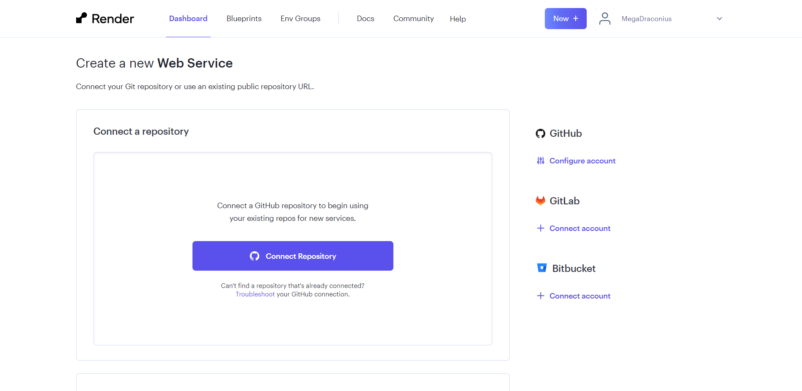
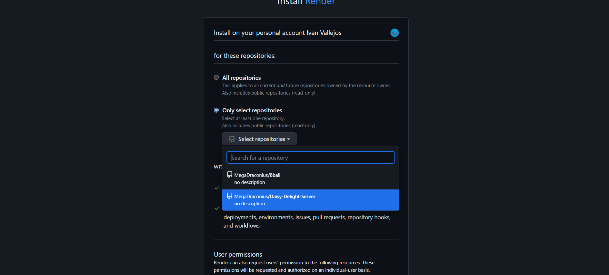

# Daisy Delight JSON-Server Deployment

Hemos utilizado un template del canal **Crystal Vibes** para poder
desplegar este Json server.

Para poder visualizar el video les dejamos el enlace a su canal de youtube y github para poder utilizar el template si ven necesario:

[Youtube Channel Crystal Vibes](https://www.figma.com/file/Gl7NNI4p3zRwZQmhRyurPZ/Daisy-Delight?type=design&node-id=0-1&mode=design&t=0gcxtvfwts8xmjpA-0)

[Github from Uma Sahni ](https://github.com/UmaSahni)

## Simple Steps to use Json Server:

1. Create a repository from the template.

2. ```bash
   git clone https://github.com/MegaDraconius/Daisy-Delight-Server
   ```

3. Change the data on **db.json**.
   Ejemplo:

   ```js
   {
       "articulos": [
        {
         "id": 1,
        "nombre": "Camiseta básica",
         "descripcion": "Camiseta de algodón de manga corta",
      "precio": 15.99,
         "stock": 100
    },
    {
         "id": 2,
         "nombre": "Pantalones vaqueros",
      "descripcion": "Pantalones vaqueros slim fit",
         "precio": 29.99,
         "stock": 50
    },
    {
       "id": 3,
       "nombre": "Zapatillas deportivas",
       "descripcion": "Zapatillas deportivas con suela de goma",
        "precio": 49.99,
       "stock": 75
       }
   ]}


   ```

4. Create an account on Render.com

5. Click on Web services 
6. Build and deploy from a Git repository
7. Conect with your favorite Version Control web 
8. Select the repository with the json server 
